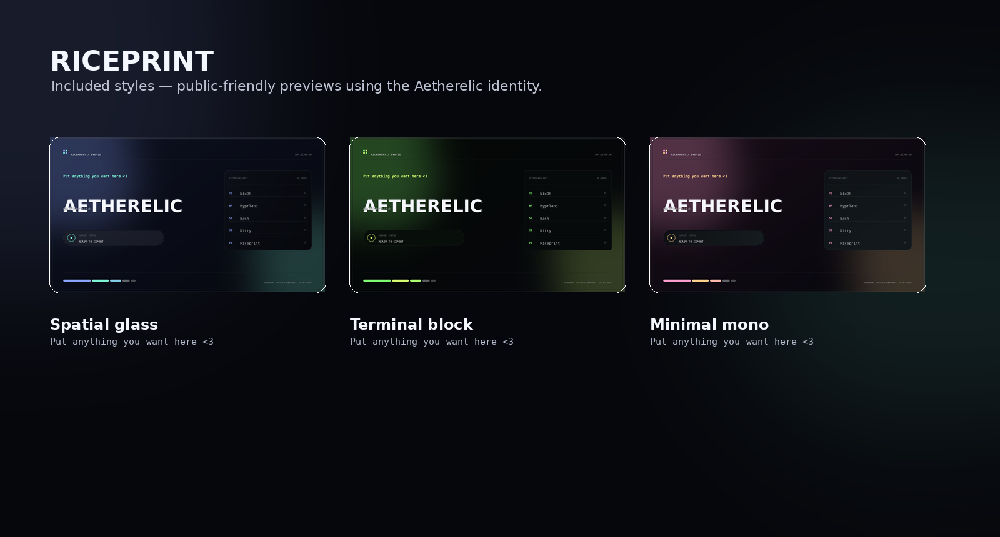
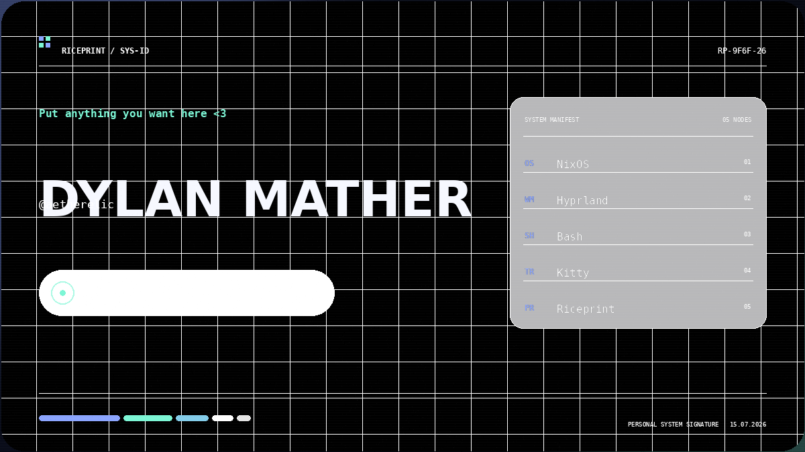
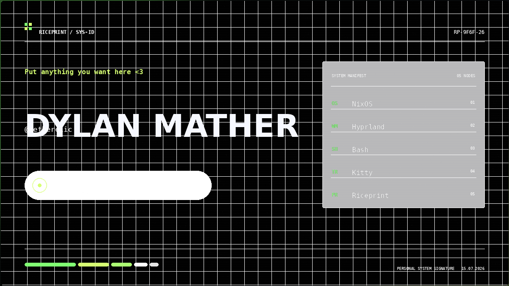
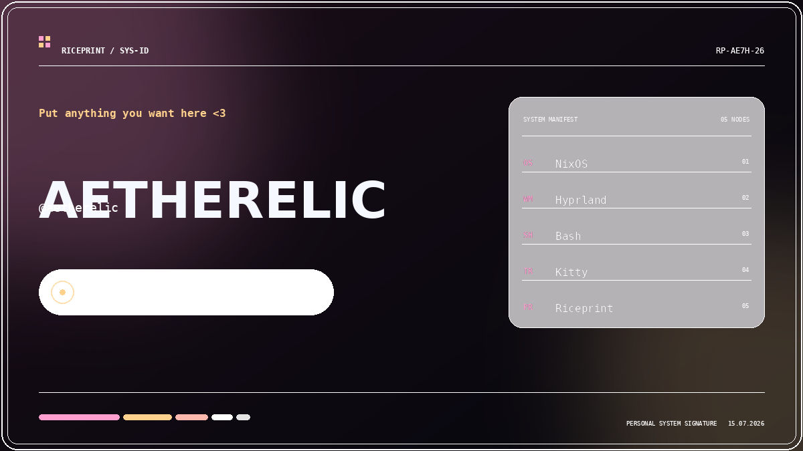

<div align="center">


# RICEPRINT

**A browser-based generator for shareable setup cards.**

[](https://aetherelic.github.io/riceprint/)
[](app.js)
[](LICENSE)



</div>

## What is Riceprint?

Riceprint is a **static web app**, It lets you manually enter your setup details, customise the design and export the result as a **1200 × 675 PNG** for READMEs, dotfiles, portfolios and rice posts.

It does not install anything, read your system automatically or run in the background.

<div align="center">

### [Create a card in your browser →](https://aetherelic.github.io/riceprint/)

</div>

## Included

- 3 Different styles (I am in the process of making more)
- Live text, colour and layout editing
- Palette presets and random colour generation
- Local autosave and shareable configuration links
- Dependency-free PNG export

## Styles

<table>
  <tr>
    <td align="center"><strong>Spatial Glass</strong></td>
    <td align="center"><strong>Terminal</strong></td>
    <td align="center"><strong>Minimal Mono</strong></td>
  </tr>
  <tr>
    <td></td>
    <td></td>
    <td></td>
  </tr>
</table>

## Run locally

```bash
git clone https://github.com/Aetherelic/riceprint.git
cd riceprint
python3 -m http.server 8080
```

Open `http://localhost:8080`.

## License

Released under the [MIT License](LICENSE).
