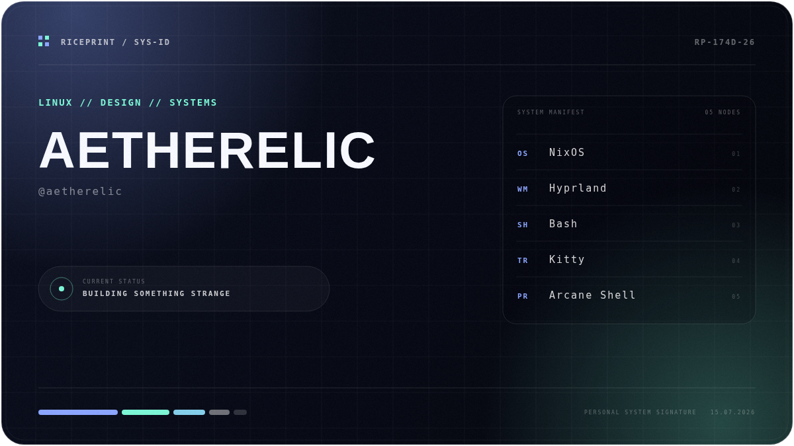

<div align="center">


# RICEPRINT

**Create exportable identity cards for Linux setups, dotfiles and desktop rice projects.**

[](https://aetherelic.github.io/riceprint/)
[](#)
[](LICENSE)


</div>

## What it does

RICEPRINT turns your Linux setup into a polished visual fingerprint. Enter your distro, window manager, shell, terminal and current project, customise the palette, then export a ready-to-use PNG.

<div align="center">
  
</div>

- Live card editor
- Spatial-glass, terminal and minimal frames
- Four palette presets plus random generation
- Dependency-free 1200 × 675 PNG export
- Local autosave and shareable configuration links
- Responsive, keyboard-friendly interface
- No accounts, tracking, build tools or backend

## Run locally

```bash
git clone https://github.com/Aetherelic/riceprint.git
cd riceprint
python3 -m http.server 8080
```

Open `http://localhost:8080`.

You can also open `index.html` directly, although the local server gives browser clipboard features the most reliable context.

## Publish with GitHub Pages

1. Push the repository to GitHub.
2. Open **Settings → Pages**.
3. Select **Deploy from a branch**.
4. Choose `main` and `/ (root)`.

The site will be available at `https://YOUR-USERNAME.github.io/riceprint/`.

## Add a generated card to your README

Export your card, save it as `assets/riceprint-card.png`, then add:

```md

```

## Project structure

```text
riceprint/
├── assets/
│   ├── favicon.svg
│   └── preview.png
├── app.js
├── index.html
├── style.css
├── LICENSE
└── README.md
```

## Roadmap

- Additional card layouts
- Optional wallpaper-derived palettes
- SVG export
- Community preset gallery

## License

Released under the [MIT License](LICENSE).
